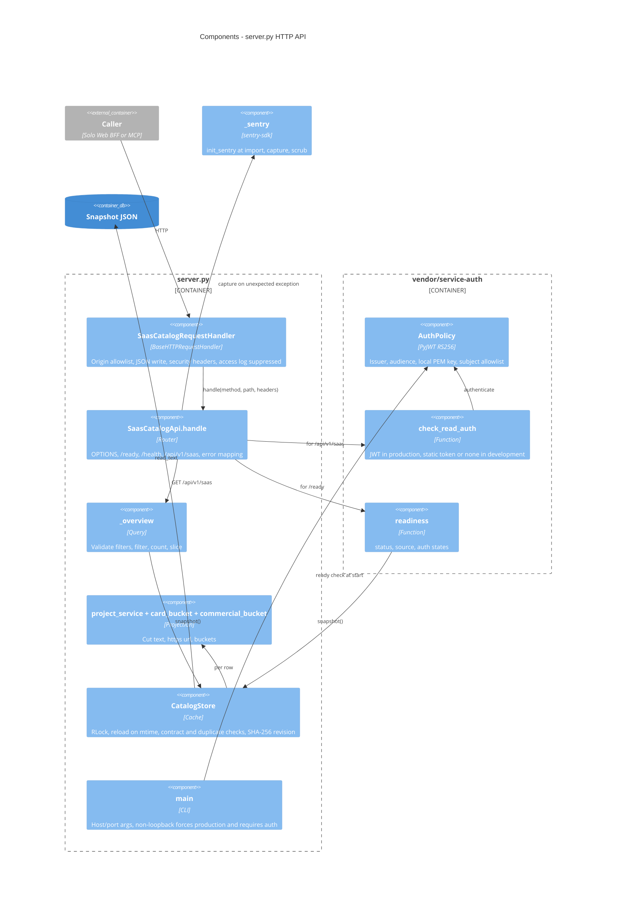
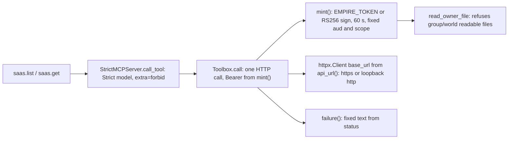

# 07 — C4 Component (HTTP API)

```mermaid
C4Component
    title Components - server.py HTTP API
    Container_Ext(client, "Caller", "Solo Web BFF or MCP")
    Container_Boundary(srv, "server.py") {
        Component(handler, "SaasCatalogRequestHandler", "BaseHTTPRequestHandler", "Origin allowlist, JSON write, security headers, access log suppressed")
        Component(api, "SaasCatalogApi.handle", "Router", "OPTIONS, /ready, /health, /api/v1/saas, error mapping")
        Component(over, "_overview", "Query", "Validate filters, filter, count, slice")
        Component(proj, "project_service + card_bucket + commercial_bucket", "Projection", "Cut text, https url, buckets")
        Component(store, "CatalogStore", "Cache", "RLock, reload on mtime, contract and duplicate checks, SHA-256 revision")
        Component(main, "main", "CLI", "Host/port args, non-loopback forces production and requires auth")
    }
    Container_Boundary(sa, "vendor/service-auth") {
        Component(policy, "AuthPolicy", "PyJWT RS256", "Issuer, audience, local PEM key, subject allowlist")
        Component(check, "check_read_auth", "Function", "JWT in production, static token or none in development")
        Component(ready, "readiness", "Function", "status, source, auth states")
    }
    Component(sentry, "_sentry", "sentry-sdk", "init_sentry at import, capture, scrub")
    ContainerDb(file, "Snapshot JSON")
    Rel(client, handler, "HTTP")
    Rel(handler, api, "handle(method, path, headers)")
    Rel(api, check, "for /api/v1/saas")
    Rel(check, policy, "authenticate")
    Rel(api, ready, "for /ready")
    Rel(ready, store, "snapshot()")
    Rel(api, over, "GET /api/v1/saas")
    Rel(over, store, "snapshot()")
    Rel(store, proj, "per row")
    Rel(store, file, "read_text")
    Rel(api, sentry, "capture on unexpected exception")
    Rel(main, policy, "ready check at start")
```

Sources: `server.py`, `vendor/service-auth/service_auth/__init__.py`, `_sentry.py`

## Component — saas-catalog-mcp

```mermaid
flowchart LR
    TOOL["saas.list / saas.get"] --> STRICT["StrictMCPServer.call_tool: Strict model, extra=forbid"]
    STRICT --> BOX["Toolbox.call: one HTTP call, Bearer from mint()"]
    BOX --> MINT["mint(): EMPIRE_TOKEN or RS256 sign, 60 s, fixed aud and scope"]
    MINT --> CFG["read_owner_file: refuses group/world readable files"]
    BOX --> HTTPX["httpx.Client base_url from api_url(): https or loopback http"]
    BOX --> FAIL["failure(): fixed text from status"]
```

Sources: `saas_catalog_mcp.py`
